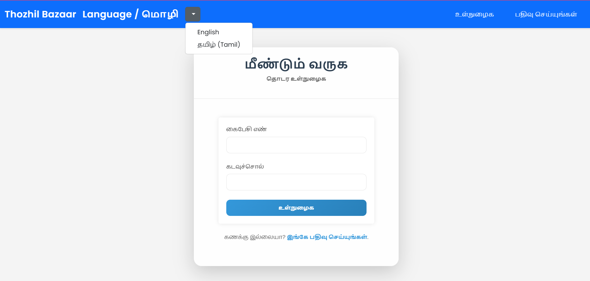
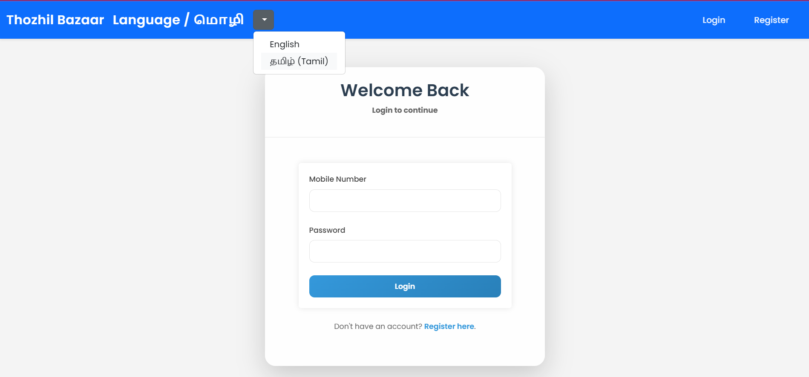
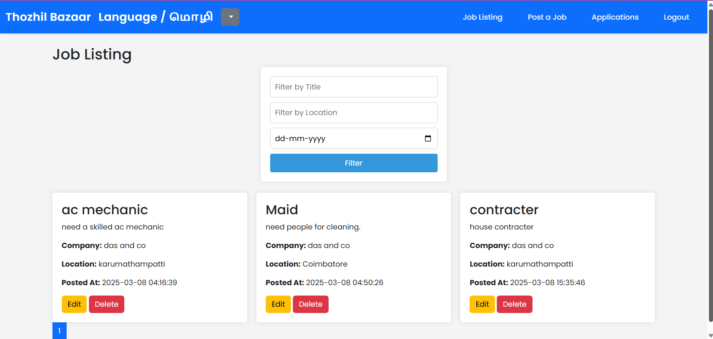
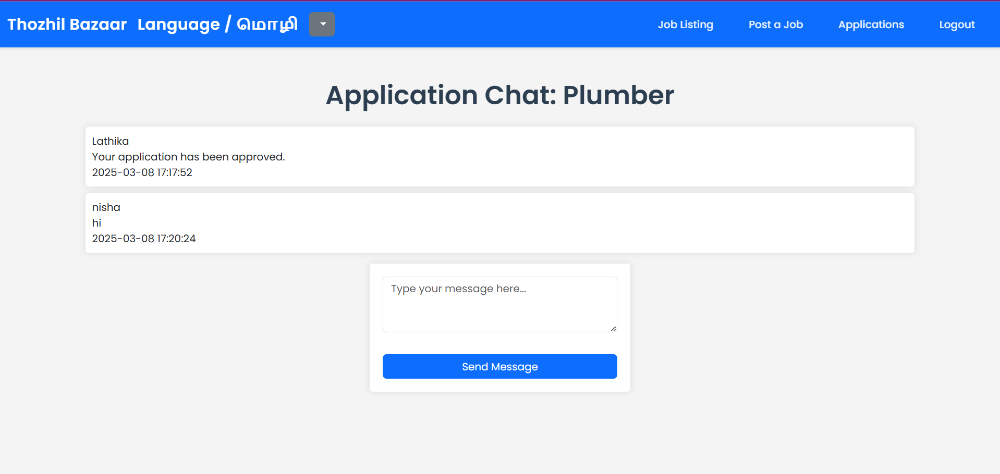

# Thozhil Bazaar - தொழில் பசார்

Thozhil Bazaar is a **local job portal** designed to **reduce unemployment in Tamil Nadu** by connecting job seekers and employers in **Tier 2 & Tier 3 cities**. It provides an accessible, bilingual (Tamil & English) platform that simplifies job searching and hiring and also provides direct employer-applicant communication.

---

## 🚀 Project Overview
### Why Thozhil Bazaar?
- **For Job Seekers:** Helps unemployed individuals find **local job opportunities** in their own language (Tamil), reducing the need for relocation.
- **For Employers:** Simplifies hiring by **connecting them with local talent**, reducing search stress for daily wage employers.
- **Bilingual Support:** Ensures accessibility for all users, making job searching and hiring seamless in **Tamil & English**.

---

## 🔥 Key Features
### For Job Seekers:
- **Localized Job Search** – Find jobs near your location easily.
- **Resume Upload** – Apply for jobs with a single click.
- **Application Tracking** – Get notified about application status.
- **Direct Chat with Employers** – Communicate instantly for updates.

### For Employers:
- **Job Posting** – Post job listings in Tamil or English.
- **Application Management** – View, sort, and track applications.
- **Direct Candidate Chat** – Interact with applicants directly.
- **Quick Approval/Reject** – Streamlined hiring process.

---

## 🛠 Tech Stack
- **Frontend:** HTML, CSS, JavaScript, Bootstrap, Jinja2
- **Backend:** Flask, Flask-SQLAlchemy, Flask-Login
- **Database:** MySQL, SQLAlchemy ORM

---

## 📌 User Flow
### 👨‍💼 Job Seeker Journey
1. Register & Complete Profile
2. Search for Jobs
3. Apply for Jobs
4. Track Application Status
5. Chat with Employers

### 🏢 Employer Journey
1. Register & Post Job Listings
2. Manage Applications
3. Approve/Reject Candidates
4. Communicate with Applicants

---

## 📸 Screenshots

### Login Page

### Job Listing Page

### Application Chat

---

## 🔧 Installation & Deployment
- **Web App** (Mobile version under development)

---

## 🤝 Contributing
We are working on making **Thozhil Bazaar open for contributions**. Stay tuned!

---

## 📩 Contact
For inquiries, feedback, or collaborations, reach out to us at **thozhilbazaar@gmail.com**.

**Thozhil Bazaar is not just a job portal—it's a movement towards a more connected, employed, and thriving community!**

